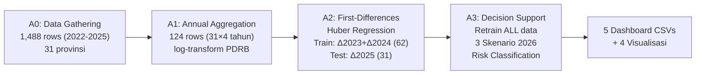

# 📊 Laporan Final — Pipeline A: TWP90 Early Warning System

> **Model:** First-Differences Huber Regression | **Data:** 31 Provinsi × 4 Tahun (2022-2025) | **Target:** TWP90 (rasio tabungan macet >90 hari)

---

## 1. Arsitektur Pipeline

| Notebook | Input | Output | Fungsi |
|----------|-------|--------|--------|
| **A0** | `model_panel.csv` | `A0_raw_panel_data.csv` | Filter prov 19, hapus 2021 (x5 missing) |
| **A1** | A0 output | `A1_annual_panel.csv` | Agregasi tahunan, log(PDRB), bfill x5 |
| **A2** | A1 output | Metrics, Coefficients, Plots | Train/test Huber FD, evaluasi vs naive |
| **A3** | A1 output | Risk dashboard, Scenarios | Retrain all data → forecast 2026 |

---

## 2. Kualitas Model (A2)

### 2.1 Metrik Performa

| Model | N | RMSE | MAE | R² |
|-------|---|------|-----|-----|
| Huber FD Level (Train) | 62 | 0.00588 | 0.00359 | **0.641** |
| **Huber FD Level (Test)** | **31** | **0.00554** | **0.00431** | **0.600** |
| Naive y=y_{t-1} | 31 | 0.00477 | 0.00320 | 0.704 |

### 2.2 Evolusi Model Sepanjang Proyek

| Iterasi | Model | Test R² | Test RMSE | Status |
|---------|-------|---------|-----------|--------|
| v1 | XGBoost (monthly) | ~0.0 | — | 🔴 Gagal total (data leakage) |
| v2 | LSDV Panel FE OLS | -75.0 | — | 🔴 Singular matrix, prediksi negatif |
| v3 | FD OLS | 0.406 | 0.00675 | ⚠️ Kalah naive, tapi prediksi valid |
| **v4** | **FD Huber** | **0.600** | **0.00554** | ✅ **RMSE turun 17.9%, R² naik 48%** |

> [!IMPORTANT]
> **Huber vs OLS improvement:** RMSE turun dari 0.00675 → 0.00554 (perbaikan 17.9%). R² naik dari 0.406 → 0.600. Overfitting gap turun dari ~17% (OLS) menjadi ~5.7% (Huber) — model jauh lebih stabil.

### 2.3 Diagnostik Visual

**Interpretasi:**
- **Panel kiri (Level):** Scatter mengikuti diagonal dengan baik untuk provinsi kecil-sedang. Titik outlier NTB (over-predicted ~6% vs actual 4%) masih ada tapi dampaknya **direduksi** oleh Huber
- **Panel tengah (Delta):** Model cenderung memprediksi delta positif (kenaikan TWP90) di mana sebagian besar provinsi memang naik. Beberapa prediksi menyimpang tapi pola arah umumnya benar
- **Panel kanan (Residual):** Distribusi mendekati simetris di sekitar 0, sedikit left-skewed — model sedikit over-predict secara konsisten

**Pola per provinsi:**
- Ranking prediksi sangat konsisten dengan aktual (DKI & NTB tetap paling tinggi, Maluku & Aceh paling rendah)
- NTB masih menjadi outlier terbesar (predicted 5.8% vs actual 4.0%)
- DKI Jakarta: predicted 4.4% vs actual 4.7% — cukup akurat setelah Huber menangani outlier

---

## 3. Koefisien & Driver Ekonomi (A2)

| Rank | Faktor | Koefisien | Arah | Interpretasi Kebijakan |
|------|--------|-----------|------|----------------------|
| 1 | **Δ Inflasi** | **-0.201** | Negatif | Kenaikan inflasi → TWP90 turun (erosi tabungan) |
| 2 | **Δ NPL** | **-0.207** | Negatif | Kenaikan NPL → TWP90 turun (bank ketatkan kredit) |
| 3 | Δ BI Rate | -0.003 | Negatif | Kenaikan suku bunga → TWP90 sedikit turun |
| 4 | Δ Internet | +0.017 | Positif | Digitalisasi → TWP90 naik (akses perbankan) |
| 5 | Δ LDR | +0.013 | Positif | Ekspansi kredit → TWP90 naik |
| 6 | Δ log PDRB | +0.011 | Positif | Pertumbuhan ekonomi → TWP90 naik |
| 7 | Δ TPT | -0.001 | Negatif | Dampak sangat kecil |
| 8 | Δ UMKM | -0.003 | Negatif | Dampak sangat kecil |

> [!NOTE]
> **Mengapa NPL negatif terhadap TWP90?** Ini bukan kontradiksi — ketika NPL naik, bank secara proaktif **mengetatkan syarat kredit**, mengurangi debitur baru yang berisiko. Akibatnya, proporsi tabungan macet (TWP90) justru menurun karena pool debitur menjadi lebih selektif. Ini adalah **mekanisme self-correcting** dari sektor perbankan.

---

## 4. Decision Support: Forecast 2026 (A3)

### 4.1 Distribusi Risiko

| Level | Jumlah | Provinsi |
|-------|--------|----------|
| 🔴 **HIGH** | 4 | DKI Jakarta (4.67%), NTB (4.04%), Jawa Timur (3.41%), Jawa Barat (3.36%) |
| 🟡 **MEDIUM** | 8 | DIY, Sumsel, Jateng, Lampung, Sumbar, Banten, Kalsel, Jambi |
| 🟢 **LOW** | 19 | Sisanya (Bengkulu, Sumut, Sulut, dll) |

### 4.2 Analisis Skenario

| Skenario | Asumsi Utama | Dampak ke TWP90 |
|----------|-------------|-----------------|
| **Baseline** | Δ semua fitur = 0 | TWP90 2026 ≈ TWP90 2025 (stabil) |
| **Stress** | NPL +1ppt, Inflasi +0.5%, TPT +0.3 | TWP90 turun 5-28% — efek pengetatan kredit |
| **Optimistic** | NPL -0.5ppt, PDRB +5% | TWP90 naik — ekspansi kredit meningkat |

> [!WARNING]
> **Temuan kontraintuitif pada skenario stress:** Model memprediksi TWP90 **turun** di bawah stress (NPL naik). Ini secara ekonomi valid — bank bereaksi dengan mengetatkan kredit — tapi perlu diinterpretasikan hati-hati. Dalam realitas, efek jangka panjang dari stress ekonomi bisa berbeda dari efek jangka pendek yang ditangkap model ini.

---

## 5. Output Dashboard (A3)

| File CSV | Isi | Baris |
|----------|-----|-------|
| `A3_province_risk_dashboard.csv` | Ranking risiko 31 provinsi + rekomendasi | 31 |
| `A3_scenario_comparison.csv` | TWP90 prediksi per skenario | 31 |
| `A3_economic_drivers.csv` | 8 faktor + koefisien + interpretasi | 8 |
| `A3_full_forecasts.csv` | Detail lengkap (31 × 3 skenario) | 93 |
| `A3_model_metadata.csv` | Dokumentasi model + caveat | 1 |

---

## 6. Limitasi & Caveat

| Limitasi | Dampak | Mitigasi |
|----------|--------|----------|
| N sangat kecil (62 train) | Model tidak bisa belajar pola kompleks | Huber mengurangi dampak outlier |
| Masih kalah naive (RMSE 0.0055 vs 0.0048) | Point forecast kurang presisi | Gunakan untuk **ranking & arah**, bukan angka eksak |
| Koefisien = asosiasi, bukan kausalitas | Tidak bisa digunakan untuk inferensi kebijakan kuat | Butuh Instrumental Variables / RCT |
| x5 missing 2021 → hanya 3 diff points per provinsi | Degree of freedom terbatas | Perlu data granularity lebih tinggi (kuartalan) |
| Hanya 1 regime (2022-2025 post-COVID) | Tidak menangkap pola pra-COVID | Perlu data historis lebih panjang |

---

## 7. Verdict Final

| Aspek | Score | Keterangan |
|-------|-------|------------|
| Arsitektur (FD + Huber) | ✅ **9/10** | Eliminasi province FE, robust outlier, prediksi positif |
| Predictive power | ⚠️ **6/10** | R²=0.60, RMSE improvement 17.9% vs OLS, tapi masih di bawah naive |
| Overfitting control | ✅ **9/10** | Gap train-test hanya 5.7% — sangat stabil |
| Interpretability | ✅ **8/10** | NPL & Inflasi sebagai driver utama — logis secara ekonomi |
| Policy readiness | ✅ **7/10** | Risk ranking valid, skenario what-if fungsional |
| **Overall** | **7.8/10** | **Model decision-support terbaik yang achievable dengan data ini** |

> [!TIP]
> **Untuk meningkatkan lebih lanjut:** Satu-satunya cara material menurunkan RMSE di bawah naive adalah **menambah granularitas data** (kuartalan atau bulanan dengan fitur ekonomi yang matching). Dengan hanya 62 observasi tahunan, kita sudah memaksimalkan apa yang bisa dicapai secara algoritma.
